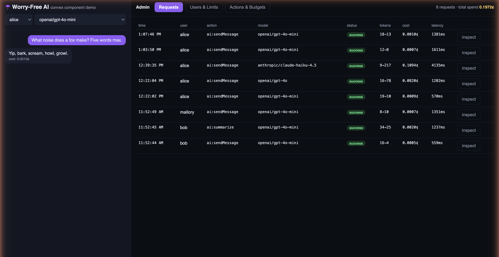
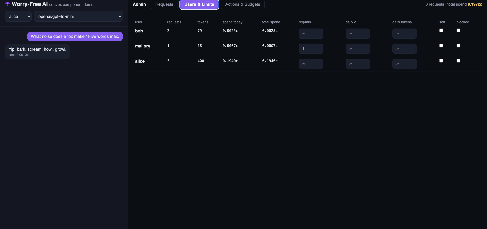
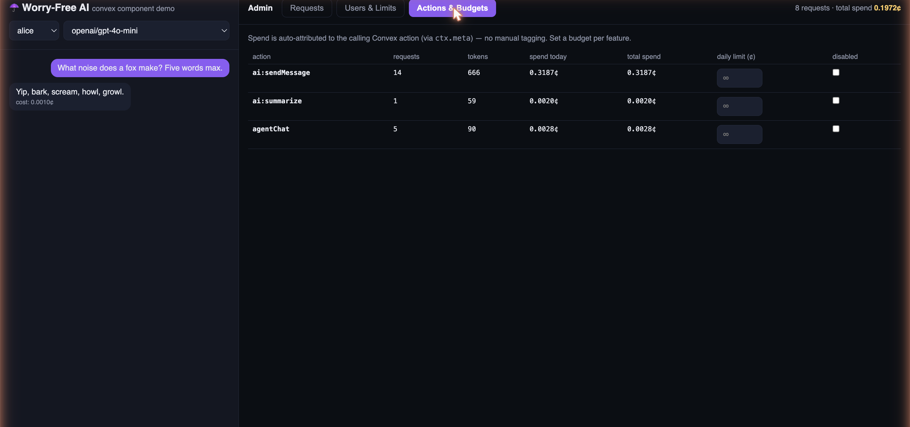

# ☂️ @convex-dev/ai-budget

**Add this component and get worry-free AI.** A metered, budget-governed layer
over the [Convex AI Gateway](https://docs.convex.dev/ai-gateway/overview). Point
your LLM calls through it and every request is tracked, priced, attributed, and
held to a budget — with spend caps that actually hold under concurrent load.

```ts
// userId defaults to the signed-in user — this is the whole integration:
const { text, costNanos } = await ai.chat(ctx, { prompt });
```

That one call is authenticated to the gateway with a short-lived deployment
token (no API keys to manage), attributed to the authenticated user, checked
against their limits, billed to the right user and feature, and written to a
full audit log you can replay later.



---

## What you get

| | |
|---|---|
| **Usage & cost tracking** | Every request stored with messages, response, tokens, latency, and per-request cost. |
| **Attribution** | Each call is attributed to a `userId` **and** to the Convex action that made it — auto-detected via `ctx.meta`, no manual tagging. Running totals per user and per action. |
| **Spend & token limits** | Per-user daily / lifetime **spend** and **token** budgets, plus a requests-per-minute rate limit and a block switch. |
| **Concurrency-safe caps** | A reserve-then-settle design makes admission a true atomic check — concurrent in-flight requests can't blow past the cap (a naive implementation overshoots ~40×). |
| **Hard or soft** | Each limit either **blocks** (`hard`) or **allows-with-a-warning** (`soft`). |
| **Per-feature budgets** | Cap or disable a whole action (e.g. `summarize`) independently of any user. |
| **Global killswitch** | A deployment-wide spend cap across all users and actions (sharded for throughput; enforced approximately). |
| **One-time bumps** | "Approve another $X" at any level (user / action / global) without changing the standing cap — daily bumps are today-only, lifetime bumps permanent. |
| **Model policy** | Allow/deny lists for models; an unknown/unpriced model **fails closed** (charged a conservative max, never $0). |
| **Replay** | Re-run any stored request with edited messages or a different model; re-runs are linked to their original (lineage). |
| **Agent-ready** | `ai.languageModel(ctx, { userId })` is a standard AI SDK model — drop it into [`@convex-dev/agent`](https://www.npmjs.com/package/@convex-dev/agent) and every agent generation is budgeted. |

---

## Install

Requires `convex@^1.45`, AI SDK 5+, and a Convex team on a paid plan (the
gateway is a paid feature).

```sh
npm install @convex-dev/ai-budget @convex-dev/ai-sdk-provider ai
```

Register the component:

```ts
// convex/convex.config.ts
import { defineApp } from "convex/server";
import aiBudget from "@convex-dev/ai-budget/convex.config";

const app = defineApp();
app.use(aiBudget);
export default app;
```

Create a client:

```ts
// convex/ai.ts
import { AIBudget } from "@convex-dev/ai-budget";
import { components } from "./_generated/api";

export const ai = new AIBudget(components.aiBudget, {
  defaultModel: "openai/gpt-4o-mini",
  // Optional: surface soft-limit warnings even on the Agent/languageModel path.
  onSoftLimit: ({ userId, warnings }) => console.warn(userId, warnings),
});
```

The admin API is namespaced: `ai.users.*`, `ai.actions.*`, `ai.global.*`,
`ai.models.*`, `ai.prices.*`, and `ai.requests.*`; `ai.chat` and
`ai.languageModel` are top-level.

---

## Quickstart

```ts
// convex/ai.ts
import { v } from "convex/values";
import { action } from "./_generated/server";

export const sendMessage = action({
  args: { prompt: v.string() },
  handler: async (ctx, { prompt }) => {
    // userId defaults to the authenticated caller (ctx.auth). Limit-checked,
    // tracked, priced. Throws a ConvexError if over a hard cap.
    const { text, costNanos, warnings } = await ai.chat(ctx, { prompt });
    return { text, costNanos, warnings };
  },
});
```

Pass an explicit `{ userId }` only for service/admin flows or when you manage
identity yourself.

Give someone a budget:

```ts
await ai.users.setLimits(ctx, {
  userId: "alice",
  dailySpendLimitNanos: 1_000_000_000, // $1.00 / day (1e9 nano)
  dailyTokenLimit: 500_000,
  requestsPerMinute: 20,
});
```

When a request would exceed a **hard** cap, `chat` throws a `ConvexError`
carrying `{ kind: "AIBudgetLimit", code, reason }`; the attempt is still
recorded (`status: "blocked"`) so you can see who's hitting limits.

---

## API reference

All methods are called from a Convex **action** (they run the gateway call) or,
for the read-only ones, a query. `ctx` is the Convex context.

**Money is integer nanodollars** (`1 USD = 1e9 nano`) everywhere — costs, limits,
and prices. Integers avoid the rounding drift floating-point cents accumulate and
keep cap comparisons exact (exact to ~$9M per value). `$1 = 1_000_000_000`.

### Generating

```ts
ai.chat(ctx, {
  userId?,           // defaults to the authenticated caller (ctx.auth)
  prompt?,           // or:
  messages?,         // [{ role, content }]
  model?,            // defaults to defaultModel
  action?,           // attribution name; defaults to the calling Convex action
}): Promise<{ text, requestId, costNanos, promptTokens, completionTokens, warnings }>
```

`warnings` is non-empty only when a **soft** limit was exceeded. If no `userId`
is passed and there is no authenticated user, `chat` throws — budgets are never
silently un-attributed.

### As an AI SDK model (Agent, generateText, streamText)

```ts
ai.languageModel(ctx, { userId, model?, action? }): LanguageModel
```

Returns a standard AI SDK `LanguageModel` that enforces the user's budget and
records usage/cost on every call — including streaming. Use it anywhere an AI
SDK model is expected:

```ts
import { Agent } from "@convex-dev/agent";

// Construct per-request so the agent is bound to this user.
const agent = new Agent(components.agent, {
  name: "assistant",
  languageModel: ai.languageModel(ctx, { userId }),
});
const { threadId } = await agent.createThread(ctx, { userId });
const result = await agent.generateText(ctx, { threadId }, { prompt });
```

Every generation the agent makes is now tracked and budgeted, attributed to
`userId` and to the calling action. See `example/convex/agentDemo.ts`.

### Replay

```ts
ai.requests.rerun(ctx, { requestId, messages?, model? }): Promise<ChatResult>
ai.requests.lineage(ctx, { requestId }): Promise<{ ancestors, reruns }>
```

`rerun` re-runs a stored request (optionally with edited messages/model), linked
to the original. `lineage` walks the re-run chain in both directions.

### User limits

```ts
ai.users.setLimits(ctx, {
  userId,
  requestsPerMinute?,
  dailySpendLimitNanos?,
  lifetimeSpendLimitNanos?,
  dailyTokenLimit?,
  lifetimeTokenLimit?,
  enforcement?,       // "hard" (block, default) | "soft" (warn but allow)
  blocked?,           // hard block on/off
})
ai.users.delete(ctx, { userId })   // remove a user and all their request rows
```

Pass a field as `undefined` to clear that limit (unlimited).

### Per-action budgets

Spend is attributed to the calling action automatically. Cap a feature:

```ts
ai.actions.setLimits(ctx, {
  name,                          // e.g. "ai:summarize"
  dailySpendLimitNanos?,
  lifetimeSpendLimitNanos?,
  dailyTokenLimit?,
  lifetimeTokenLimit?,
  enforcement?,                  // "hard" | "soft"
  disabled?,                     // kill switch for the whole feature
})
```

### Global (deployment-wide) budget

```ts
ai.global.setLimits(ctx, { dailySpendLimitNanos?, lifetimeSpendLimitNanos?, enforcement? })
ai.global.status(ctx)   // { limits, spentTodayNanos, spentTotalNanos }
```

A killswitch across all users and actions. Backed by a sharded counter for
throughput, so it's enforced **approximately** (bounded overshoot under burst) —
per-user and per-action caps remain exact.

### One-time bumps ("approve another $X")

```ts
ai.users.bump(ctx, { userId, dailyNanos?, lifetimeNanos? })
ai.actions.bump(ctx, { name, dailyNanos?, lifetimeNanos? })
ai.global.bump(ctx, { dailyNanos?, lifetimeNanos? })
```

Adds headroom on top of the standing cap without changing it. Daily bumps apply
to today only (reset with the day); lifetime bumps are permanent.

### Model policy

```ts
ai.models.setPolicy(ctx, { mode, models })
// mode: "open" (default) | "allowlist" (only these) | "denylist" (all but these)
ai.models.getPolicy(ctx)
```

### Pricing

Prices are in **cents per million tokens**. Sensible defaults ship for common
models; override or add any model:

```ts
ai.prices.set(ctx, { model, inputNanosPerMTok, outputNanosPerMTok })  // must be ≥ 0
ai.prices.list(ctx)
```

An unpriced model is charged the conservative maximum of the known table (so a
cap can never be bypassed by naming an unlisted model) and its request rows are
flagged `unpricedModel: true` so you know to add a real price.

### Observability

```ts
ai.users.list(ctx)                      // per-user spend today / total / tokens / limits
ai.actions.list(ctx)                    // per-action spend & totals
ai.requests.list(ctx, { userId?, limit? })  // the audit log (blocked attempts included)
```

---

## How spend caps stay correct

A naive tracker checks the running total, makes the call, then records the cost.
Under concurrency that leaks badly: dozens of in-flight requests all read the
same pre-spend total and all pass, so spend blows past the cap (measured at
~40× before this design).

`ai-budget` instead **reserves then settles**:

1. **Reserve.** `startRequest` estimates the request's cost/tokens and, *in the
   same transaction as the limit check*, reserves them against the capped
   entity. Under Convex's serializable isolation this makes admission a true
   atomic check-and-reserve — concurrent requests see each other's holds.
2. **Settle.** `finishRequest` writes only the request's own (uncontended) row
   and schedules a fold of the real cost into the totals, releasing the
   reservation. A request is therefore never orphaned mid-flight.
3. **Reconcile.** A once-a-minute cron folds any stragglers and releases
   reservations for requests that died before settling. Settlement is
   **exactly-once** (a terminal request is never re-folded), so a slow request
   that the reconciler already swept can't double-count when it finally returns.

Reservations are only taken on entities that actually have a cap, so uncapped
traffic never serializes. The `error.md` file documents the adversarial audits
this design survived, with live repros.

**One guarantee, all scopes.** Per-user, per-action, and global caps run through
the *same* admission check — a request is admitted only when
`committed + reserved + estimate ≤ cap` (bumps included). The only thing that
differs is the holder: per-user and per-action reserve on a single document, an
exact atomic check-and-reserve; the **global** killswitch is backed by a sharded
counter for throughput, so its committed total is read as an eventually-consistent
sum with no cross-request reservation. That makes the global cap **approximate** —
it can overshoot by a bounded amount under a burst — the deliberate
exactness-for-throughput trade for a deployment-wide cap, and the only scope
that isn't exact.

---

## Security: before you ship

The component is deliberately **identity-agnostic** — like
`@convex-dev/rate-limiter`, it trusts the `userId` and admin calls your app
hands it. **Your app owns auth.** The `example/` app skips auth on purpose to
keep the demo frictionless (a persona dropdown, public admin functions); do not
copy its endpoints verbatim. In production:

1. **Let `userId` default to the authenticated caller** (that's the built-in
   behavior — `ai.chat(ctx, { prompt })` uses `ctx.auth.getUserIdentity()`).
   Only pass an explicit `userId` from a trusted server context; never forward a
   client-supplied id, or a caller can spend under someone else's budget or
   dodge their own limits by rotating ids.
2. **Gate every admin call** — `setLimits`, `setActionLimits`, `setModelPolicy`,
   `setPrice`, `deleteUser` — behind an admin check. A limit-management surface
   must not be operable by the party being limited.
3. **Scope reads and replay to the owner.** `listRequests` / `getRequest` /
   `lineage` return full prompts, responses, and spend, and `rerun` re-runs a
   request billed to its **original** user. An unchecked client `requestId` is an
   IDOR — verify `request.userId === caller`, or treat `rerun` and the
   cross-user views as admin-only.

---

## Example app

`example/` is a full working demo: chat as different personas on the left; a live
admin panel on the right with the request audit log (inspect → edit → re-run,
with lineage), a users table (rate / spend / token limits, soft toggle, block,
one-time bump), and per-action budgets.

Per-user limits — rate, daily spend, daily tokens, hard/soft, block, one-time bump:



Per-action budgets, auto-attributed to the calling Convex function (including
agent generations via `agentChat`):



```sh
cd example
npm install
npx convex dev      # terminal 1 — provisions a dev deployment
npm run dev         # terminal 2 — Vite app
```

---

## Development

```sh
npm test            # vitest + convex-test: reserve/settle, exactly-once,
                    # token quotas, soft limits, model policy, pricing
npm run build       # emit dist/ (client + component) for publishing
```

## Layout

- `src/component/` — the component: tables (`users`, `actions`, `requests`,
  `prices`, `settings`), the reserve/settle mutations (`startRequest` /
  `finishRequest`), the idempotent `foldTotals`, and the `reconcile` cron.
- `src/client/` — the `AIBudget` class: `chat`, `languageModel` (AI SDK
  middleware around `convexGateway`), `rerun`, and the admin methods above.
- `example/` — the demo app.

## License

Apache-2.0
